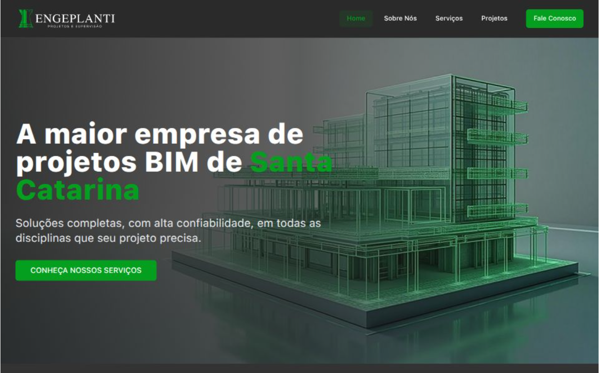

# 🌱 Engeplanti Projetos e Supervisão

Este projeto é uma **refatoração completa do site institucional da Engeplanti Projetos e Supervisão**, desenvolvido com foco em **modernização de layout, performance e boas práticas de desenvolvimento front-end**.

O objetivo principal foi transformar um site tradicional em uma **experiência moderna, responsiva e escalável**, servindo também como **projeto de portfólio** para demonstrar habilidades em desenvolvimento web.

---

## 🚀 Sobre o Projeto

A proposta deste projeto foi recriar o site da Engeplanti utilizando tecnologias atuais e uma abordagem mais estruturada, com foco em:

- Melhorar a **experiência do usuário (UX)**
- Criar uma interface mais **moderna e limpa (UI)**
- Aplicar **boas práticas de componentização**
- Garantir **responsividade em diferentes dispositivos**
- Otimizar a *renderização**

---

## 🛠️ Tecnologias Utilizadas

- **React.js**
- **TypeScript**
- **Tailwind CSS**
- **Vite**

---

## 💡 Principais Melhorias

- 🔹 Refatoração completa do layout original  
- 🔹 Criação de componentes reutilizáveis  
- 🔹 Estrutura de projeto organizada  
- 🔹 Implementação de **tema dark/light**  
- 🔹 Melhor distribuição de conteúdo e hierarquia visual  
- 🔹 Navegação mais fluida e moderna  

---

## 🎨 Interface e Design

O projeto foi desenvolvido com foco em um visual:

- Minimalista  
- Profissional  
- Responsivo  
- Alinhado com a identidade visual da empresa  

---

## 📱 Responsividade

O site foi totalmente adaptado para:

- 📱 Mobile  
- 💻 Desktop  
- 📟 Tablets  

Garantindo uma experiência consistente em qualquer dispositivo.

---

## 📂 Estrutura do Projeto

A aplicação segue uma arquitetura baseada em componentes:

src/

  ├── components/
  
  ├── pages/
  
  ├── assets/

---

## ⚠️ Aviso Importante

Este projeto foi desenvolvido **exclusivamente para fins de estudo e portfólio**.

- Não possui vínculo oficial com a empresa  
- Não deve ser utilizado como versão oficial  
- Não está aberto para uso comercial ou redistribuição  

---

## 🧠 Aprendizados

Durante o desenvolvimento, foram reforçados conceitos como:

- Componentização em React  
- Uso avançado de Tailwind  
- Responsividade na prática  
- Estruturação de projetos profissionais  

---

## 📸 Preview

---

## 📌 Status do Projeto

🚧 Em desenvolvimento / melhorias contínuas  

---

## 👨‍💻 Autor

Desenvolvido por **Carlos Henrique**  
💼 Desenvolvedor Front-End  
